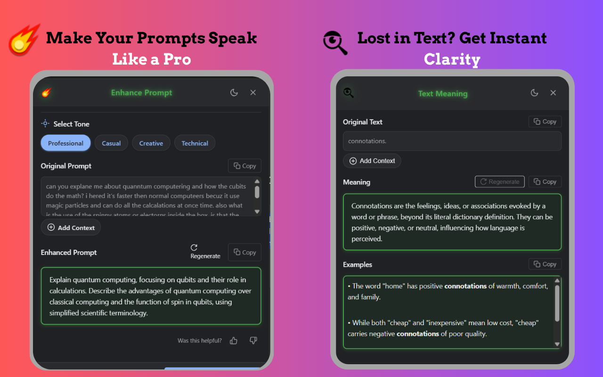

# 🚀 LevelUp AI - Chrome Extension

<div align="center">
  
  
  
  
  
</div>

<div align="center">
  <h3>🎯 Transform Your Text with AI-Powered Intelligence</h3>
  <p>A powerful Chrome extension that enhances prompts and text using Google's Gemini AI models. Get instant text improvement, grammar correction, and writing enhancement directly within any webpage.</p>
  <p>(Currently under review in chrome webstore will be released in 3 days)</p>
  
  <a href="https://level-up-extension-guide-two.vercel.app/" target="_blank">
    
  </a>
</div>

---

## 📋 Table of Contents

- [✨ Features](#-features)
- [🚀 Installation](#-installation)
- [🎯 Usage](#-usage)
- [🔧 Technical Details](#-technical-details)
- [🛠️ Development](#️-development)
- [📞 Support](#-support)
- [📋 Changelog](#-changelog)
- [🤝 Contributing](#-contributing)
- [📄 License](#-license)

---

## ✨ Features

### 🤖 **AI-Powered Text Enhancement Engine**
- **Google Gemini 2.0 Flash** (Default) + Multiple Gemini Models
- **Smart Processing**: Grammar correction, spelling fixes, explicit language removal
- **Model Selection**: Gemini 1.5 Pro, 1.5 Flash, 2.0 Pro, 2.0 Flash
- **Configurable Creativity**: Adjustable temperature (0.0-1.0) with visual slider

### 🎨 **Modern User Interface**
- **Tabbed Navigation**: Home, History, Favorites, Settings, About
- **Theme Support**: Dark/Light mode with automatic preference saving
- **Responsive Design**: 420px × 600px popup with intuitive sidebar
- **Material Icons**: Professional Google Material Symbols
- **Toast Notifications**: Real-time feedback for all actions

### ⚡ **Smart Text Selection & Enhancement**
- **Floating Toolbar**: Appears instantly when text is selected
- **Context Menu**: Right-click integration for quick access
- **Real-Time Processing**: Live API calls with loading indicators
- **Enhanced Dialog**: Beautiful before/after comparison view
- **One-Click Operations**: Instant copying with visual feedback

### 📚 **Advanced History & Favorites**
- **Smart History**: Auto-saves last 20 enhancements with timestamps
- **Favorites System**: Star important enhancements for quick access
- **Search & Filter**: Find enhancements with grid/list views
- **Bulk Operations**: Clear all with confirmation dialogs
- **Model Tracking**: Shows which AI model enhanced each text

### ⚙️ **Comprehensive Settings**
- **Secure API Management**: Protected storage with visibility toggle
- **Quick Setup**: 4 pre-configured API keys for immediate use
- **Model Selection**: Full Gemini model dropdown
- **Temperature Control**: Visual creativity adjustment slider
- **Output Preferences**: Markdown, auto-copy, notifications
- **Connection Status**: Real-time API connectivity monitoring


---

## 🚀 Installation

### **Prerequisites**
- Google Chrome browser (latest version recommended)
- Google AI Studio API key ([Get free key](https://aistudio.google.com/))

### **Method 1: Chrome Web Store (Recommended)**
> 🔄 *Extension is currently under review for Chrome Web Store*

### **Method 2: Developer Mode Installation**

1. **Clone the Repository**
   ```bash
   git clone https://github.com/DebuggingDork/levelup-ai-extension.git
   cd levelup-ai-extension
   ```

2. **Load in Chrome**
   - Open Chrome and navigate to `chrome://extensions/`
   - Enable "Developer mode" (toggle in top right)
   - Click "Load unpacked" and select the extension directory

3. **Configure API Key**
   - Click the LevelUp AI icon in your Chrome toolbar
   - Navigate to the Settings tab
   - Enter your Google AI Studio API key
   - Or use one of the 4 pre-configured keys for quick setup

### **Complete Setup Guide**
For detailed installation, configuration, and usage instructions, visit:
**[📚 LevelUp AI Setup Guide](https://level-up-extension-guide-two.vercel.app/)**

---

## 🎯 Usage

### **Basic Text Enhancement**
1. **Select Text**: Highlight any text on any webpage
2. **Activate**: Click the floating LevelUp icon or right-click for context menu
3. **Choose Mode**: Select enhancement type (Professional, Casual, Creative, Technical)
4. **Review**: View enhanced text in the comparison dialog
5. **Apply**: Copy or insert enhanced text with one click

### **Advanced Features**
- **History Tab**: Browse and reuse your previous enhancements
- **Favorites Tab**: Save and organize important enhancements  
- **Settings Tab**: Customize AI model, temperature, and preferences
- **Theme Toggle**: Switch between dark and light modes seamlessly


---

## 🔧 Technical Details

### **Architecture**
- **Manifest Version**: V3 (latest Chrome extension standard)
- **Core Technologies**: Vanilla JavaScript, HTML5, CSS3
- **AI Integration**: Google Gemini API
- **Storage**: Chrome Storage API (sync and local)

### **File Structure**
```
levelup-ai-extension/
├── manifest.json          # Extension configuration (Manifest V3)
├── popup.html            # Main UI interface (478 lines)
├── popup.js              # UI functionality (798 lines)
├── content.js            # Content script for webpage integration (2175 lines)
├── background.js         # Background service worker (136 lines)
├── popup.css             # Styling for popup interface
├── content.css           # Styling for floating elements
├── icons/                # Extension icons
│   ├── icon16.png
│   ├── icon48.png
│   ├── icon128.png
│   └── meaning_icon.png
└── README.md             # This file
```

### **API Integration**
- **Endpoint**: `https://generativelanguage.googleapis.com/v1beta/models/`
- **Supported Models**: All Gemini variants (1.5 Pro, 1.5 Flash, 2.0 Pro, 2.0 Flash)
- **Request Format**: JSON with content parts and generation config
- **Error Handling**: User-friendly error messages and retry logic

### **Permissions**
```json
{
  "activeTab": "Access to current tab for text selection",
  "scripting": "Execute content scripts on webpages", 
  "storage": "Save settings and enhancement history",
  "contextMenus": "Right-click menu integration",
  "clipboardWrite": "Copy enhanced text to clipboard",
  "host_permissions": "Access to Google AI APIs"
}
```

---

## 🛠️ Development

### **Setup Development Environment**
1. **Clone and Install**
   ```bash
   git clone https://github.com/DebuggingDork/levelup-ai-extension.git
   cd levelup-ai-extension
   ```

2. **Load in Chrome**
   - Enable Developer mode in `chrome://extensions/`
   - Load unpacked extension

3. **Make Changes**
   - Edit files as needed
   - Refresh the extension in Chrome to see changes

### **Building for Production**
```bash
# Create a zip file for Chrome Web Store submission
zip -r levelup-ai-extension.zip . -x "*.git*" "node_modules/*" "*.md"
```

### **Testing**
- Test on various websites (Google Docs, Gmail, social media, etc.)
- Verify functionality across different text types
- Test API rate limits and error handling

---

## 👥 Who Can Benefit?

- **🎓 Students**: Improve academic writing and research papers
- **💼 Professionals**: Enhance business communications and reports
- **✍️ Content Creators**: Refine blog posts, articles, and social media
- **🌍 Non-native English Speakers**: Improve language clarity and grammar
- **📝 Writers**: Get creative inspiration and writing assistance

---

## 🌟 Key Benefits

- **🔄 Seamless Integration**: Works on any website without leaving the page
- **⚡ Instant Enhancement**: Real-time AI-powered text improvement
- **🔒 Privacy Focused**: No data collection, all processing is local
- **🎨 User-Friendly**: Intuitive interface with helpful tooltips
- **🎛️ Customizable**: Multiple AI models and settings for different needs
- **💾 Persistent**: Save and organize your enhancements

---

## 📞 Support

**Created by Mani Mamidala**

### **Get Help**
- 📧 **Email**: mamidala.mani1355@gmail.com
- 🐛 **Bug Reports**: [Create an Issue](https://github.com/DebuggingDork/levelup-ai-extension/issues)
- 💡 **Feature Requests**: [Discussion Board](https://github.com/DebuggingDork/levelup-ai-extension/discussions)
- 📚 **Documentation**: [Setup Guide](https://level-up-extension-guide-two.vercel.app/)

---

## 📋 Changelog

### **v1.0.0** - July 2025
- 🎉 Initial release
- ✨ Full Gemini AI integration
- 🎨 Modern UI with dark/light themes
- 📚 History and favorites system
- ⚙️ Comprehensive settings panel
- 🔧 Manifest V3 architecture

---

## 🤝 Contributing

We welcome contributions! Here's how you can help:

1. **Fork the Repository**
2. **Create a Feature Branch**
   ```bash
   git checkout -b feature/amazing-feature
   ```
3. **Commit Your Changes**
   ```bash
   git commit -m 'Add some amazing feature'
   ```
4. **Push to Branch**
   ```bash
   git push origin feature/amazing-feature
   ```
5. **Open a Pull Request**

### **Development Guidelines**
- Follow existing code style and conventions
- Add comments for complex logic
- Test thoroughly on multiple websites
- Update documentation as needed

---

## 🔮 Roadmap

- [ ] **Multi-language Support**: Support for 20+ languages
- [ ] **Custom Templates**: User-defined enhancement templates
- [ ] **Team Collaboration**: Share enhancements with teammates
- [ ] **Advanced Analytics**: Usage statistics and insights
- [ ] **Browser Shortcuts**: System-wide keyboard shortcuts
- [ ] **AI Model Training**: Custom model fine-tuning
- [ ] **Integration APIs**: Connect with other productivity tools

---

## 📄 License

This project is licensed under the MIT License - see the [LICENSE](LICENSE) file for details.

---

## 🙏 Acknowledgments

- **Google Gemini AI** for providing the powerful language models
- **Chrome Extension Team** for the excellent developer tools
- **Material Design** for the beautiful icons and design principles
- **Open Source Community** for inspiration and support

---

<div align="center">
  <h3>🚀 Ready to Level Up Your Writing?</h3>
  <p><strong>Install LevelUp AI today and transform your text with the power of Google's Gemini AI!</strong></p>
  
  <a href="https://level-up-extension-guide-two.vercel.app/" target="_blank">
    
  </a>
</div>

---

<div align="center">
  
**⭐ If you find this project helpful, please consider giving it a star! ⭐**

**Built with ❤️ by Mani Mamidala**

*Last updated: July 2025*

</div>